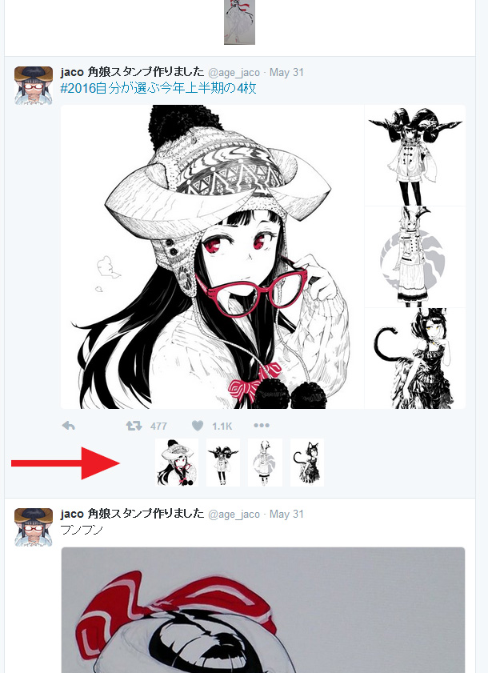

# Twitter Inline Expansion

Userscript for inline-expansion of `:orig` full-resolution twitter images

<a href="twitter-orig.user.js?raw=true">Install Link</a>

<a href="https://greasyfork.org/en/scripts/21409-twitter-inline-expansion">Greasyfork Mirror</a>

<a href="doc/inline-expand.webm?raw=true">Video</a> showing the script in action

